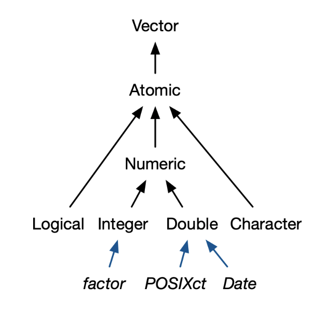

# Basicos 

```{r}
TRUE == TRUE 
```

## Vectores 

**¿Qúe es un vector?**





La estructura más simple de datos en R. 

`x <- c("a", "b", "c")`

Se puede construir un vector de tipo numérico, lógico o carácter.
La letra **c** significa "concatenar", y de hecho es un acrónimo para dicha palabra.

Existen cuatro tipos comunes: *logical*, *integer*, *double*, *character* 

**Propiedades de un vector:** 

  1. Tipo
```{r}
x <- 1:5
typeof(x)
```
  2. Longitud
```{r}
x <- 1:5
length(x)
```
  3. Atributos
```{r}
x <- 1:5
class(x)
```

**Trabajar con vectores**

En R se indexa la información desde 1, para acceder a la información de una posición especifica de un vector se usan los [ ]. 
```{r}
x <- c("Montserrat", "Nidia", "Armando", "Oscar", "Diego")
x[3]
```
```{r}
x[c(1,2,3)]
```
```{r}
x[1:3]
```
```{r}
x[-3]
```

Para agregar un valor al vector se debe tomar en cuenta el tipo de vector. *Nota: si indexo con signo negativo, se elimina esa posición* 
```{r}
x[6] <- "Fernanda"
x
```
```{r}
x <- x[-6]
x
```

**Ejercicio**

  1. ¿Qué pasa si agrego un número a un vector de caracteres?
  2. Crea un vector con el nombre *mi_primer_vector* con 10 palabras.  

## Listas

Pueden tener mas de un objeto de diferente clase, es decir, puedo almanecer dentro de la misma lista objetos de clase caracter, factor y numericos, inclusive pueden añardiser data.frame!!! 

```{r}
my_list <- list(c("a", 1) , c("hola", "como", "estas"), 
             data.frame(Nombres = c("Nidia", "Mont"), Sexo= c("F", "M")))
my_list
```

Para ver la estructura de cualquir tipo de dato se ocupa el comando **str()**
```{r}
str(my_list)
```

¿Cómo se accede a los datos de una lista?

¿Cuál es la diferencia entre los siguientes dos codigos?

```{r}
my_list[1]
```
```{r}
my_list[[1]]
```

Con [[]] accedemos al valor (genera un objeto de menor peso de memoria), y con [] accedemos a la posición de la lista. 
Para obtener el numero 1 de la posicion 1 de mi lista se hace lo siguiente:
```{r}
my_list[[1]][2]
```

Para acceder a la palabra "como" de nuestra lista se hace lo siguiente:
```{r}
my_list[[2]][2]
```

Tambien se puede ocupar el simbolo **$** para acceder a los datos de una lista cuando cada valor tiene un nombre
```{r}
my_list_2 <- list(Datos_sin_sentido = c("a", "b", 4, 8), Palabras = c("hola", "como", "estas"), 
            Un_data_frame = data.frame(Nombres = c("Nidia", "Mont"), Sexo= c("F", "M")))

my_list_2
```

```{r}
my_list_2$Un_data_frame
```

**Ejercicio**

  1. Buscar como agrego y quito valores de una lista
  2. Crea una lista que contenga en la posición 1 un vector con los nombres de los integrantes de la clase; en la posición 2 un vector con las edades de los integrantes de la clase; en la posición 3 un vector con el sexo de los integrantes de la clase. Poner titulo a cada posición. 
  
## Data.frame

Un data.frame es una lista con el mismo numero de filas o columnas. Se puede considerar a cada columna como un vector (ya que tienen el mismo tipo de datos) o a cada fila una lista (ya que contiene diferente tipo de datos). 

Ejemplo:
```{r}
my_df <- data.frame(
  Integrantes = c("Nidia", "Monse", "Mont", "Damian"),
  Sexo = c("Femenino", "Femenino", "Femenino", "Masculino"),
  Correo = c("nidibelh@gmail.com", 
             "monserrat.urbina.santana@gmail.com ",
             "loredoguillen@gmail.com", 
             "damianae.54@gmail.com"),
  Velocidad = c(8, 10, 7, 9)
)

my_df
```

Para acceder a los datos de un data frame se utiliza **[ , ]**, en la primera posición (antes de la coma) se especifica el numero o numero de filas, nombre o vector de logicos; en la segunda posición se especifica que columnas se quieren; un espacio en blanco significa que tome todos los valores.
```{r}
my_df[2,]
```
```{r}
my_df[,3]
```

¿Por qué sucede esto?

Otra forma de acceder a los datos de un data.frame es con su nombre y el simbolo **$**
```{r}
my_df$Integrantes
```

```{r}
my_df$Integrantes[3]
```


**Ejercicios**

- Buscar como añadir una columna al data.frame
- Como poner nombre a las columnas y a las filas 
- Genera un data.frame con los datos de arriba y añadé dos columnas, una con edad y otra con peso. 
   