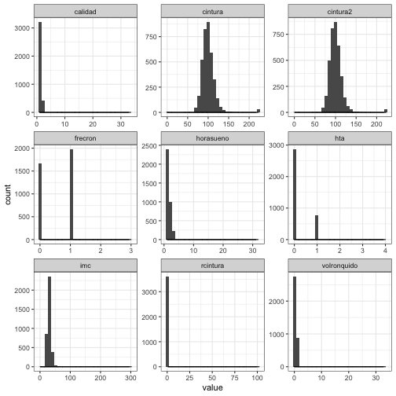

Clase 3
========================================================
author: Erick Cuevas Fernández
date: 05 septiembre 2019
autosize: true

Análisis exploratorio de datos
========================================================
*Paso 1. Conocer estructura de datos*

*Paso 2. Obtener y leer datos*

**Paso 3. ¿Qué me dicen mis datos?**


```r
# devtools::install_github("Erickcufe/seekerBio")

# sleep_disorder <- seekerBio::seeker_gwas("Sleep Disorder")

# write.csv(sleep_disorder, "Clase_3/sleep_disorder.csv")

# paths <- seekerBio::seeker_gen_pathway(sleep_disorder$GeneSymbol)

# write.csv(paths, "Clase_3/Paths_sleep.csv")

# Freq <- seekerBio::seeker_snp_freq(sleep_disorder$SNPS)

# write.csv(Freq, "Clase_3/Freq_sleep.csv")
```

Para afianzar lo aprendido en la clase anterior:

- Lee/carga el archivo *sleep_disorder.csv*
- Lee/carga el archivo *Paths_sleep.csv*
- Lee/carga el archivo *Freq_sleep.csv*
- Lee/carga el archivo de la carpeta **Seccion_nutricion**: *Cuestionario_de_Problemas_de_Suenno*

Recuerda que con **foreing::read.dta(file.dta)** tambien lo puedes hacer

Para calentar motores...  Missing Values
========================================================
Un vistazo a los datos


```r
sleep_disorder_mx <- read.csv("/Users/erickCuevas/Documents/GitProyects/Curso-R-2019/Seccion_Nutricion/Cuestionario_de_Problemas_de_Suenno/ensanut_suenno_16112016.csv")

is.na(head(sleep_disorder_mx, 2))
```

```
  folio  inte idinsert entidad munici locali   maq  edad  sexo intsel
1 FALSE FALSE    FALSE   FALSE  FALSE  FALSE FALSE FALSE FALSE  FALSE
2 FALSE FALSE    FALSE   FALSE  FALSE  FALSE FALSE FALSE FALSE  FALSE
  intsel2 su101 su102 su103 su104 su105 su106 su107 su107a su107b su107c
1    TRUE FALSE FALSE FALSE FALSE  TRUE  TRUE FALSE  FALSE  FALSE  FALSE
2   FALSE FALSE FALSE FALSE FALSE  TRUE  TRUE FALSE  FALSE  FALSE  FALSE
  su108 su109 su110 su111 su112 su113 su114 su115 su116 tiempo_gen est_var
1 FALSE FALSE FALSE FALSE  TRUE FALSE  TRUE FALSE  TRUE      FALSE   FALSE
2 FALSE FALSE FALSE  TRUE  TRUE  TRUE  TRUE FALSE FALSE      FALSE   FALSE
  region_h code_upm rural    c1 ponde_f  a301 a313g a313h  a401 a502a
1    FALSE    FALSE FALSE FALSE   FALSE FALSE FALSE FALSE FALSE FALSE
2    FALSE    FALSE FALSE FALSE   FALSE FALSE  TRUE  TRUE FALSE FALSE
  a502b a502c a502d a1301 a1301a a1312c cintura cintura2 rcintura
1 FALSE FALSE FALSE FALSE  FALSE  FALSE   FALSE    FALSE    FALSE
2 FALSE FALSE FALSE FALSE  FALSE  FALSE   FALSE    FALSE    FALSE
  grupoednut   imc imc_valid imc_valid_clas horasueno calidad volronquido
1      FALSE FALSE     FALSE          FALSE     FALSE   FALSE       FALSE
2      FALSE FALSE     FALSE          FALSE     FALSE   FALSE        TRUE
  frecron  cat1 cat1c  cat2 cat2c   hta  saos saosc sexofem insomnio ronca
1   FALSE FALSE FALSE FALSE FALSE FALSE FALSE FALSE   FALSE    FALSE FALSE
2    TRUE  TRUE FALSE FALSE FALSE FALSE FALSE FALSE   FALSE    FALSE FALSE
  roncafuerte roncahab roncamol apnea catberlin1 noreparador cansado
1       FALSE    FALSE    FALSE FALSE      FALSE       FALSE   FALSE
2       FALSE    FALSE    FALSE FALSE      FALSE       FALSE   FALSE
  cabeceado catberlin2 catberlin3 catberlin1a catberlin2a berlinscore
1     FALSE      FALSE      FALSE       FALSE       FALSE       FALSE
2     FALSE      FALSE      FALSE       FALSE       FALSE       FALSE
  berlinriesgo berlinscoresinbmi berlinriesgosinbmi malacalsueno
1        FALSE             FALSE              FALSE        FALSE
2        FALSE             FALSE              FALSE        FALSE
  impactoinsom insom3sem insomhabi horasueno1 horasueno2 horasueno3
1        FALSE     FALSE     FALSE      FALSE      FALSE      FALSE
2        FALSE     FALSE     FALSE      FALSE      FALSE      FALSE
  clonazepam diazepam alprazolam sedante cinturaprom padormir1 padormir2
1      FALSE    FALSE      FALSE   FALSE       FALSE     FALSE     FALSE
2      FALSE    FALSE      FALSE   FALSE       FALSE     FALSE     FALSE
```


========================================================
Un vistazo a los datos

```r
summary(sleep_disorder_mx)
```

```
                  folio           inte          idinsert       entidad    
 1                   :   2   1      :5701           :   2   15     : 819  
 010010001209A0020131:   1   2      :2334    TIAMINA:   1   30     : 805  
 010010001209A0020161:   1   3      : 440   10000   :   1   09     : 604  
 010010001209A0080071:   1   4      : 123   10002   :   1   07     : 568  
 010010001209A0080101:   1   5      :  39   10005   :   1   11     : 562  
 010010001209A0120041:   1   7      :   7   10009   :   1   21     : 421  
 (Other)             :8647   (Other):  10   (Other) :8647   (Other):4875  
     munici         locali          maq            edad     
 007    : 428   0001   :3681   MC056  : 291   40     : 222  
 005    : 286   0009   : 197   MC058  : 277   38     : 203  
 011    : 283   0006   : 142   MC014  : 261   32     : 201  
 006    : 230   0027   : 109   MC024  : 260   36     : 200  
 030    : 228   0042   : 109   MC072  : 251   33     : 197  
 017    : 219   0019   : 104   MC068  : 247   37     : 197  
 (Other):6980   (Other):4312   (Other):7067   (Other):7434  
      sexo            intsel     intsel2          su101       
 Min.   :0.0000   Min.   :1   Min.   :10.00   Min.   : 1.000  
 1st Qu.:0.0000   1st Qu.:1   1st Qu.:10.00   1st Qu.: 7.000  
 Median :0.0000   Median :1   Median :10.00   Median : 8.000  
 Mean   :0.3422   Mean   :1   Mean   :10.76   Mean   : 7.587  
 3rd Qu.:1.0000   3rd Qu.:1   3rd Qu.:12.00   3rd Qu.: 8.000  
 Max.   :1.0000   Max.   :1   Max.   :15.00   Max.   :99.000  
 NA's   :5        NA's   :5   NA's   :3523    NA's   :15      
     su102           su103           su104           su105      
 Min.   :1.000   Min.   :1.000   Min.   :1.000   Min.   :1.000  
 1st Qu.:1.000   1st Qu.:2.000   1st Qu.:1.000   1st Qu.:1.000  
 Median :1.000   Median :2.000   Median :2.000   Median :2.000  
 Mean   :1.418   Mean   :2.538   Mean   :1.627   Mean   :1.529  
 3rd Qu.:2.000   3rd Qu.:3.000   3rd Qu.:2.000   3rd Qu.:2.000  
 Max.   :3.000   Max.   :5.000   Max.   :2.000   Max.   :2.000  
 NA's   :5       NA's   :5       NA's   :5       NA's   :5424   
     su106          su107                      su107a    
 Min.   :1      Min.   :1.000                     :8375  
 1st Qu.:1      1st Qu.:1.000   CLONAZEPAM        : 100  
 Median :1      Median :1.000   DIAZEPAM          :  40  
 Mean   :1      Mean   :1.034   ALPRAZOLAM        :  22  
 3rd Qu.:1      3rd Qu.:1.000   BROMAZEPAM-LEXOTAN:   9  
 Max.   :1      Max.   :2.000   FLUOXETINA        :   9  
 NA's   :7602   NA's   :5       (Other)           :  99  
           su107b                   su107c    
              :8622                    :8650  
 CITALOPRAN   :   2    ESPINO BLANCO   :   1  
 SERTRALINA   :   2    MARCA OVISEN    :   1  
  LECHUGA     :   1    TIAMINA         :   1  
 ADEPSIQUE    :   1    VALERIANA EDULIS:   1  
 CARVAMACEPINA:   1                           
 (Other)      :  25                           
                            su108          su109            su110     
                               :   7          :4804            :4804  
  AGASTACHE MEXICANA           :   1   1      :1366    40.00 MG:   1  
  PIRIDOXINA Y CIANOCOBALAMINA):   1   2      :1200   1        :1547  
  TUMBA VAQUERO                :   1   3      : 541   2        : 513  
 1                             :3846   4      : 387   3        : 998  
 2                             :3105   5      : 354   4        : 366  
 9                             :1693   (Other):   2   9        : 425  
     su111           su112           su113           su114     
 Min.   :1.000   Min.   :1.000   Min.   :1.000   Min.   :1     
 1st Qu.:1.000   1st Qu.:1.000   1st Qu.:1.000   1st Qu.:1     
 Median :2.000   Median :1.000   Median :1.000   Median :1     
 Mean   :1.635   Mean   :1.014   Mean   :1.002   Mean   :1     
 3rd Qu.:2.000   3rd Qu.:1.000   3rd Qu.:1.000   3rd Qu.:1     
 Max.   :3.000   Max.   :4.000   Max.   :4.000   Max.   :1     
 NA's   :4805    NA's   :8223    NA's   :6267    NA's   :5821  
     su115           su116            tiempo_gen      est_var    
 Min.   :1.000   Min.   :1.000             :   7   211    : 889  
 1st Qu.:2.000   1st Qu.:3.000   1         :   2   411    : 452  
 Median :2.000   Median :4.000   2         :   1   30001  : 451  
 Mean   :1.969   Mean   :3.947   2016/10/25:8644   222    : 412  
 3rd Qu.:2.000   3rd Qu.:5.000                     15000  : 397  
 Max.   :2.000   Max.   :5.000                     7001   : 387  
 NA's   :7       NA's   :8390                      (Other):5666  
    region_h       code_upm           rural          c1      
 4      :2942   4o07   :  51             :   5        :   5  
 2      :2812   1o36   :  50   1         :4262   1    :8644  
 1      :1891   4o05   :  50   1o53      :   1   2    :   2  
 3      :1001   4o08   :  50   2         :4383   212  :   1  
        :   5   4o06   :  48   2016/10/25:   2   28002:   1  
 122    :   1   4o31   :  48   2o83      :   1   2o35 :   1  
 (Other):   2   (Other):8357                                 
    ponde_f                       a301          a313g         
 Min.   :     1   3                 :7600   Min.   :   1.000  
 1st Qu.:  1708   1                 : 960   1st Qu.:   2.000  
 Median :  3876                     :  74   Median :   2.000  
 Mean   :  8222   2                 :  16   Mean   :   5.418  
 3rd Qu.:  8542   11382.349375963713:   1   3rd Qu.:   2.000  
 Max.   :398806   1o84              :   1   Max.   :3380.115  
 NA's   :5        (Other)           :   2   NA's   :7674      
     a313h            a401              a502a           a502b      
 Min.   :1.000   Min.   :   1.000   Min.   :1.000   Min.   :1.000  
 1st Qu.:2.000   1st Qu.:   2.000   1st Qu.:2.000   1st Qu.:2.000  
 Median :2.000   Median :   2.000   Median :2.000   Median :2.000  
 Mean   :1.988   Mean   :   2.254   Mean   :1.982   Mean   :1.992  
 3rd Qu.:2.000   3rd Qu.:   2.000   3rd Qu.:2.000   3rd Qu.:2.000  
 Max.   :2.000   Max.   :2411.408   Max.   :3.000   Max.   :2.000  
 NA's   :7675    NA's   :75         NA's   :74      NA's   :75     
     a502c          a502d           a1301           a1301a     
 Min.   :1.00   Min.   :1.000   Min.   :1.000   Min.   :1.000  
 1st Qu.:2.00   1st Qu.:2.000   1st Qu.:2.000   1st Qu.:1.000  
 Median :2.00   Median :2.000   Median :3.000   Median :2.000  
 Mean   :1.99   Mean   :1.984   Mean   :2.288   Mean   :1.747  
 3rd Qu.:2.00   3rd Qu.:2.000   3rd Qu.:3.000   3rd Qu.:2.000  
 Max.   :2.00   Max.   :2.000   Max.   :9.000   Max.   :3.000  
 NA's   :75     NA's   :74      NA's   :74      NA's   :4498   
     a1312c         cintura          cintura2         rcintura      
 Min.   : 0.00   Min.   :  0.00   Min.   :  1.00   Min.   :  1.000  
 1st Qu.: 0.00   1st Qu.: 86.40   1st Qu.: 86.40   1st Qu.:  1.000  
 Median : 3.00   Median : 94.50   Median : 94.50   Median :  1.000  
 Mean   :43.14   Mean   : 96.32   Mean   : 96.36   Mean   :  1.052  
 3rd Qu.:98.00   3rd Qu.:103.00   3rd Qu.:103.10   3rd Qu.:  1.000  
 Max.   :99.00   Max.   :222.20   Max.   :222.20   Max.   :102.000  
 NA's   :58      NA's   :557      NA's   :557      NA's   :589      
   grupoednut          imc           imc_valid      imc_valid_clas  
 Min.   :  0.00   Min.   :  1.00   Min.   :  4.00   Min.   : 1.000  
 1st Qu.:  4.00   1st Qu.: 24.83   1st Qu.: 24.82   1st Qu.: 1.000  
 Median :  4.00   Median : 27.97   Median : 27.97   Median : 2.000  
 Mean   :  4.01   Mean   : 28.65   Mean   : 28.55   Mean   : 2.097  
 3rd Qu.:  4.00   3rd Qu.: 31.70   3rd Qu.: 31.68   3rd Qu.: 3.000  
 Max.   :101.80   Max.   :301.86   Max.   :116.10   Max.   :31.819  
 NA's   :236      NA's   :286      NA's   :300      NA's   :300     
   horasueno         calidad        volronquido        frecron     
 Min.   : 1.000   Min.   : 1.000   Min.   : 0.000   Min.   :0.000  
 1st Qu.: 1.000   1st Qu.: 1.000   1st Qu.: 0.000   1st Qu.:0.000  
 Median : 1.000   Median : 1.000   Median : 0.000   Median :1.000  
 Mean   : 1.398   Mean   : 1.107   Mean   : 0.257   Mean   :0.536  
 3rd Qu.: 2.000   3rd Qu.: 1.000   3rd Qu.: 0.000   3rd Qu.:1.000  
 Max.   :31.819   Max.   :33.504   Max.   :33.504   Max.   :3.000  
 NA's   :5        NA's   :5        NA's   :4803     NA's   :4803   
      cat1           cat1c             cat2            cat2c       
 Min.   :0.000   Min.   :0.0000   Min.   :0.0000   Min.   :0.0000  
 1st Qu.:1.000   1st Qu.:0.0000   1st Qu.:0.0000   1st Qu.:0.0000  
 Median :2.000   Median :0.0000   Median :0.0000   Median :0.0000  
 Mean   :2.229   Mean   :0.3074   Mean   :0.6035   Mean   :0.2017  
 3rd Qu.:3.000   3rd Qu.:1.0000   3rd Qu.:1.0000   3rd Qu.:0.0000  
 Max.   :5.000   Max.   :4.0000   Max.   :2.0000   Max.   :2.0000  
 NA's   :4803    NA's   :5        NA's   :6        NA's   :6       
      hta              saos            saosc           sexofem      
 Min.   :0.0000   Min.   :0.0000   Min.   :0.0000   Min.   :0.0000  
 1st Qu.:0.0000   1st Qu.:0.0000   1st Qu.:0.0000   1st Qu.:0.0000  
 Median :0.0000   Median :1.0000   Median :0.0000   Median :1.0000  
 Mean   :0.1691   Mean   :0.6763   Mean   :0.1538   Mean   :0.6578  
 3rd Qu.:0.0000   3rd Qu.:1.0000   3rd Qu.:0.0000   3rd Qu.:1.0000  
 Max.   :4.0000   Max.   :3.0000   Max.   :3.0000   Max.   :1.0000  
 NA's   :6        NA's   :5        NA's   :5        NA's   :5       
    insomnio          ronca         roncafuerte        roncahab     
 Min.   :0.0000   Min.   :0.0000   Min.   :0.0000   Min.   :0.0000  
 1st Qu.:0.0000   1st Qu.:0.0000   1st Qu.:0.0000   1st Qu.:0.0000  
 Median :0.0000   Median :0.0000   Median :0.0000   Median :0.0000  
 Mean   :0.1975   Mean   :0.4451   Mean   :0.1076   Mean   :0.2385  
 3rd Qu.:0.0000   3rd Qu.:1.0000   3rd Qu.:0.0000   3rd Qu.:0.0000  
 Max.   :1.0000   Max.   :2.0000   Max.   :1.0000   Max.   :1.0000  
 NA's   :5        NA's   :5        NA's   :5        NA's   :5       
    roncamol          apnea           catberlin1     noreparador    
 Min.   :0.0000   Min.   :0.00000   Min.   :0.000   Min.   :0.0000  
 1st Qu.:0.0000   1st Qu.:0.00000   1st Qu.:0.000   1st Qu.:0.0000  
 Median :0.0000   Median :0.00000   Median :0.000   Median :0.0000  
 Mean   :0.1626   Mean   :0.04937   Mean   :1.002   Mean   :0.2764  
 3rd Qu.:0.0000   3rd Qu.:0.00000   3rd Qu.:2.000   3rd Qu.:1.0000  
 Max.   :1.0000   Max.   :1.00000   Max.   :5.000   Max.   :4.0000  
 NA's   :5        NA's   :5         NA's   :5       NA's   :5       
    cansado         cabeceado         catberlin2       catberlin3    
 Min.   :0.0000   Min.   :0.00000   Min.   :0.0000   Min.   :0.0000  
 1st Qu.:0.0000   1st Qu.:0.00000   1st Qu.:0.0000   1st Qu.:0.0000  
 Median :0.0000   Median :0.00000   Median :0.0000   Median :0.0000  
 Mean   :0.3277   Mean   :0.03041   Mean   :0.6337   Mean   :0.4523  
 3rd Qu.:1.0000   3rd Qu.:0.00000   3rd Qu.:1.0000   3rd Qu.:1.0000  
 Max.   :1.0000   Max.   :1.00000   Max.   :4.0000   Max.   :2.0000  
 NA's   :5        NA's   :5         NA's   :5        NA's   :5       
  catberlin1a     catberlin2a      berlinscore      berlinriesgo  
 Min.   :0.000   Min.   :0.0000   Min.   :0.0000   Min.   :0.000  
 1st Qu.:0.000   1st Qu.:0.0000   1st Qu.:0.0000   1st Qu.:0.000  
 Median :0.000   Median :0.0000   Median :1.0000   Median :0.000  
 Mean   :0.307   Mean   :0.2096   Mean   :0.9681   Mean   :0.263  
 3rd Qu.:1.000   3rd Qu.:0.0000   3rd Qu.:2.0000   3rd Qu.:1.000  
 Max.   :2.000   Max.   :1.0000   Max.   :3.0000   Max.   :3.000  
 NA's   :5       NA's   :5        NA's   :5        NA's   :5      
 berlinscoresinbmi berlinriesgosinbmi  malacalsueno     impactoinsom   
 Min.   :0.0000    Min.   :0.0000     Min.   :0.0000   Min.   :0.0000  
 1st Qu.:0.0000    1st Qu.:0.0000     1st Qu.:0.0000   1st Qu.:0.0000  
 Median :1.0000    Median :0.0000     Median :0.0000   Median :0.0000  
 Mean   :0.6844    Mean   :0.1571     Mean   :0.1008   Mean   :0.1215  
 3rd Qu.:1.0000    3rd Qu.:0.0000     3rd Qu.:0.0000   3rd Qu.:0.0000  
 Max.   :3.0000    Max.   :3.0000     Max.   :3.0000   Max.   :1.0000  
 NA's   :5         NA's   :5          NA's   :5        NA's   :5       
   insom3sem        insomhabi       horasueno1       horasueno2    
 Min.   :0.0000   Min.   :0.000   Min.   :0.0000   Min.   :0.0000  
 1st Qu.:0.0000   1st Qu.:0.000   1st Qu.:0.0000   1st Qu.:0.0000  
 Median :0.0000   Median :0.000   Median :1.0000   Median :0.0000  
 Mean   :0.3735   Mean   :0.176   Mean   :0.6833   Mean   :0.2398  
 3rd Qu.:1.0000   3rd Qu.:0.000   3rd Qu.:1.0000   3rd Qu.:0.0000  
 Max.   :2.0000   Max.   :1.000   Max.   :1.0000   Max.   :1.0000  
 NA's   :5        NA's   :5       NA's   :5        NA's   :5       
   horasueno3        clonazepam         diazepam         alprazolam      
 Min.   :0.00000   Min.   :0.00000   Min.   :0.00000   Min.   :0.000000  
 1st Qu.:0.00000   1st Qu.:0.00000   1st Qu.:0.00000   1st Qu.:0.000000  
 Median :0.00000   Median :0.00000   Median :0.00000   Median :0.000000  
 Mean   :0.07735   Mean   :0.01156   Mean   :0.00474   Mean   :0.002659  
 3rd Qu.:0.00000   3rd Qu.:0.00000   3rd Qu.:0.00000   3rd Qu.:0.000000  
 Max.   :1.00000   Max.   :1.00000   Max.   :1.00000   Max.   :1.000000  
 NA's   :5         NA's   :5         NA's   :5         NA's   :5         
    sedante        cinturaprom                  padormir1   
 Min.   :0.0000   Min.   :  0.00                     :8361  
 1st Qu.:0.0000   1st Qu.: 86.40   CLONAZEPAM        : 100  
 Median :0.0000   Median : 94.50   DIAZEPAM          :  40  
 Mean   :0.0333   Mean   : 96.32   ALPRAZOLAM        :  22  
 3rd Qu.:0.0000   3rd Qu.:103.05   ?                 :  14  
 Max.   :1.0000   Max.   :222.20   BROMAZEPAM-LEXOTAN:   9  
 NA's   :5        NA's   :557      (Other)           : 108  
             padormir2   
                  :8622  
 0                :   2  
 CITALOPRAN       :   2  
 GABAPENTINA      :   2  
 101.9000015258789:   1  
 ADEPSIQUE        :   1  
 (Other)          :  24  
```

========================================================
Un vistazo a los datos


```r
str(sleep_disorder_mx)
```

```
'data.frame':	8654 obs. of  99 variables:
 $ folio             : Factor w/ 8653 levels "010010001209A0020131",..: 1 2 3 4 5 6 7 8 9 10 ...
 $ inte              : Factor w/ 14 levels ""," MARCA OVISEN",..: 3 3 6 3 3 3 6 3 3 3 ...
 $ idinsert          : Factor w/ 8653 levels ""," TIAMINA",..: 3515 3516 3328 3345 3537 3517 3518 3126 3145 3146 ...
 $ entidad           : Factor w/ 34 levels ""," LECHUGA",..: 4 4 4 4 4 4 4 4 4 4 ...
 $ munici            : Factor w/ 108 levels ""," ESPINO BLANCO",..: 4 4 4 4 4 4 4 4 4 4 ...
 $ locali            : Factor w/ 179 levels ""," AGASTACHE MEXICANA",..: 4 4 4 4 4 4 4 4 4 4 ...
 $ maq               : Factor w/ 65 levels ""," PASSIFLORA EDULIS",..: 22 22 20 20 22 22 22 19 19 19 ...
 $ edad              : Factor w/ 80 levels ""," 40.00 MG",..: 50 38 27 30 19 69 46 38 43 39 ...
 $ sexo              : int  1 1 0 0 1 0 0 0 1 0 ...
 $ intsel            : int  1 1 1 1 1 1 1 1 1 1 ...
 $ intsel2           : int  NA 10 NA NA NA NA 10 10 10 NA ...
 $ su101             : int  6 8 6 6 8 9 7 6 7 8 ...
 $ su102             : int  2 1 2 2 1 1 1 2 2 1 ...
 $ su103             : int  2 3 3 3 2 2 2 2 3 2 ...
 $ su104             : int  2 2 2 1 1 2 1 2 1 1 ...
 $ su105             : int  NA NA NA 1 1 NA 1 NA 1 1 ...
 $ su106             : int  NA NA NA 1 1 NA NA NA NA 1 ...
 $ su107             : int  2 1 1 1 1 2 1 1 1 1 ...
 $ su107a            : Factor w/ 63 levels "","ADEPSIQUE",..: 15 1 1 1 1 15 1 1 1 1 ...
 $ su107b            : Factor w/ 31 levels ""," LECHUGA",..: 1 1 1 1 1 1 1 1 1 1 ...
 $ su107c            : Factor w/ 5 levels ""," ESPINO BLANCO",..: 1 1 1 1 1 1 1 1 1 1 ...
 $ su108             : Factor w/ 7 levels ""," AGASTACHE MEXICANA",..: 5 7 6 5 5 7 5 5 6 7 ...
 $ su109             : Factor w/ 8 levels ""," PASSIFLORA EDULIS",..: 5 1 1 4 4 1 5 5 1 1 ...
 $ su110             : Factor w/ 7 levels ""," 40.00 MG",..: 3 1 1 3 3 1 6 3 1 1 ...
 $ su111             : int  1 NA NA 2 1 NA 2 1 NA NA ...
 $ su112             : int  NA NA NA NA NA NA NA NA NA NA ...
 $ su113             : int  1 NA 1 1 NA NA NA NA NA NA ...
 $ su114             : int  NA NA 1 1 NA NA NA 1 NA 1 ...
 $ su115             : int  2 1 2 2 2 2 1 2 2 2 ...
 $ su116             : int  NA 5 NA NA NA NA 5 NA NA NA ...
 $ tiempo_gen        : Factor w/ 4 levels "","1","2","2016/10/25": 4 4 4 4 4 4 4 4 4 4 ...
 $ est_var           : Factor w/ 42 levels "","1","10001",..: 18 18 18 18 18 18 18 18 18 18 ...
 $ region_h          : Factor w/ 8 levels "","1","122","2",..: 4 4 4 4 4 4 4 4 4 4 ...
 $ code_upm          : Factor w/ 330 levels "","1","1a17",..: 174 174 174 174 174 174 174 174 174 174 ...
 $ rural             : Factor w/ 6 levels "","1","1o53",..: 4 4 4 4 4 4 4 4 4 4 ...
 $ c1                : Factor w/ 6 levels "","1","2","212",..: 2 2 2 2 2 2 2 2 2 2 ...
 $ ponde_f           : num  41460 10220 21001 10501 4527 ...
 $ a301              : Factor w/ 8 levels "","1","11382.349375963713",..: 2 8 8 8 8 8 8 8 8 8 ...
 $ a313g             : num  2 NA NA NA NA NA NA NA NA NA ...
 $ a313h             : int  2 NA NA NA NA NA NA NA NA NA ...
 $ a401              : num  2 2 2 2 2 2 2 2 2 2 ...
 $ a502a             : int  2 2 2 2 2 2 2 2 2 2 ...
 $ a502b             : int  2 2 2 2 2 2 2 2 2 2 ...
 $ a502c             : int  2 2 2 2 1 2 2 2 2 2 ...
 $ a502d             : int  2 2 2 2 2 2 2 2 2 2 ...
 $ a1301             : int  1 2 2 2 1 2 1 2 3 3 ...
 $ a1301a            : int  2 2 2 2 2 2 2 2 NA NA ...
 $ a1312c            : int  0 30 98 98 1 0 0 0 0 0 ...
 $ cintura           : num  99.2 98.6 95.9 110.2 188.3 ...
 $ cintura2          : num  99.4 98.6 95.8 110.2 188.4 ...
 $ rcintura          : num  1 1 1 1 1 1 1 1 1 1 ...
 $ grupoednut        : num  4 4 4 4 4 4 4 4 4 4 ...
 $ imc               : num  26.7 27.3 29.6 33.1 37 ...
 $ imc_valid         : num  26.7 27.3 29.6 33.1 37 ...
 $ imc_valid_clas    : num  2 2 2 3 3 2 1 2 1 1 ...
 $ horasueno         : num  2 1 2 2 1 1 1 2 1 1 ...
 $ calidad           : num  1 1 1 1 1 1 1 1 1 1 ...
 $ volronquido       : num  0 NA NA 0 0 NA 0 0 NA NA ...
 $ frecron           : int  1 NA NA 1 1 NA 0 1 NA NA ...
 $ cat1              : int  3 NA NA 2 3 NA 1 3 NA NA ...
 $ cat1c             : int  1 0 0 1 1 0 0 1 0 0 ...
 $ cat2              : int  1 0 2 2 0 0 0 1 0 1 ...
 $ cat2c             : int  0 0 1 1 0 0 0 0 0 0 ...
 $ hta               : int  0 0 0 0 0 0 0 0 0 0 ...
 $ saos              : int  1 0 1 2 1 0 0 1 0 0 ...
 $ saosc             : int  0 0 0 1 0 0 0 0 0 0 ...
 $ sexofem           : int  0 0 1 1 0 1 1 1 0 1 ...
 $ insomnio          : int  0 0 0 0 0 0 0 0 0 0 ...
 $ ronca             : int  1 0 0 1 1 0 1 1 0 0 ...
 $ roncafuerte       : int  0 0 0 0 0 0 0 0 0 0 ...
 $ roncahab          : int  1 0 0 1 1 0 0 1 0 0 ...
 $ roncamol          : int  1 0 0 0 1 0 0 1 0 0 ...
 $ apnea             : int  0 0 0 0 0 0 0 0 0 0 ...
 $ catberlin1        : int  3 0 0 2 3 0 1 3 0 0 ...
 $ noreparador       : int  1 0 1 1 0 0 0 0 0 0 ...
 $ cansado           : int  0 0 1 1 0 0 0 1 0 1 ...
 $ cabeceado         : int  0 1 0 0 0 0 1 0 0 0 ...
 $ catberlin2        : int  1 1 2 2 0 0 1 1 0 1 ...
 $ catberlin3        : int  0 0 0 1 1 0 0 0 0 0 ...
 $ catberlin1a       : int  1 0 0 1 1 0 0 1 0 0 ...
 $ catberlin2a       : int  0 0 1 1 0 0 0 0 0 0 ...
 $ berlinscore       : int  1 0 1 3 2 0 0 1 0 0 ...
 $ berlinriesgo      : int  0 0 0 1 1 0 0 0 0 0 ...
 $ berlinscoresinbmi : int  1 0 1 2 1 0 0 1 0 0 ...
 $ berlinriesgosinbmi: int  0 0 0 1 0 0 0 0 0 0 ...
 $ malacalsueno      : int  0 0 0 0 0 0 0 0 0 0 ...
 $ impactoinsom      : int  0 0 0 1 1 0 0 0 0 1 ...
 $ insom3sem         : int  0 0 0 1 1 0 1 0 1 1 ...
 $ insomhabi         : int  0 0 0 1 1 0 1 0 1 1 ...
 $ horasueno1        : int  0 1 0 0 1 1 1 0 1 1 ...
 $ horasueno2        : int  1 0 1 1 0 0 0 1 0 0 ...
 $ horasueno3        : int  0 0 0 0 0 0 0 0 0 0 ...
 $ clonazepam        : int  1 0 0 0 0 1 0 0 0 0 ...
 $ diazepam          : int  0 0 0 0 0 0 0 0 0 0 ...
 $ alprazolam        : int  0 0 0 0 0 0 0 0 0 0 ...
 $ sedante           : int  1 0 0 0 0 1 0 0 0 0 ...
 $ cinturaprom       : num  99.3 98.6 95.9 110.2 188.4 ...
 $ padormir1         : Factor w/ 66 levels "","?","0","1",..: 20 1 1 1 1 20 1 1 1 1 ...
 $ padormir2         : Factor w/ 30 levels "","0","101.9000015258789",..: 1 1 1 1 1 1 1 1 1 1 ...
```

========================================================


```r
#Limpieza selectiva de los datos sin valor 
#Limpiar NA de solamente la variable sexo
sleep_disorder_mx.cleaned<-sleep_disorder_mx[!is.na(sleep_disorder_mx$sexo),]
#Filas completas para un data frame 
# complete.cases(sleep_disorder_mx) #Checa en que altura de fila hay un NA
sleep_disorder_mx.cleaned.2<- sleep_disorder_mx[complete.cases(sleep_disorder_mx),]

#Convertir algun valor en NA
sleep_disorder_mx$sexo[sleep_disorder_mx$padormir1=="?"]<-NA
```

========================================================


```r
#Medidas de centralización y dispersión
mean(sleep_disorder_mx$cinturaprom) #Devuelve NA porque aun tiene NA
```

```
[1] NA
```

```r
mean(sleep_disorder_mx$cinturaprom, na.rm=TRUE) #Quita los NA y nos arroja un resultado
```

```
[1] 96.3213
```

```r
sd(sleep_disorder_mx$cinturaprom)
```

```
[1] NA
```

```r
sd(sleep_disorder_mx$cinturaprom,na.rm=TRUE)
```

```
[1] 18.80604
```

Replace Missing
========================================================


```r
#Genera una nueva columna, reemplazando NA con el promedio de las observaciones
sleep_disorder_mx$cinturaprom.mean <- ifelse(
                  is.na(sleep_disorder_mx$cinturaprom), #Si esto es verdad
                  mean(sleep_disorder_mx$cinturaprom, na.rm=TRUE), #se ejecuta esto
                      sleep_disorder_mx$cinturaprom #sino pongo el valor original
                           )
```

Evitando duplicados
========================================================


```r
family.salary=c(40000,60000,50000,80000,60000,70000,60000)
family.size=c(4,3,2,2,3,4,3)
family.car=c("Lujo","Compacto","Utilitario","Lujo","Compacto","Compacto","Compacto")

family<-data.frame(family.salary,family.size,family.car)
family.unique <- unique(family)

duplicated(family)
```

```
[1] FALSE FALSE FALSE FALSE  TRUE FALSE  TRUE
```

```r
family[duplicated(family),]
```

```
  family.salary family.size family.car
5         60000           3   Compacto
7         60000           3   Compacto
```

Vamos más alla
========================================================
Hay que quedarnos solo con variables numericas que nos puedan interesar, eliminar columnas que tengan **NAs**, y eliminar duplicados. 


```r
selected <- data.frame(sleep_disorder_mx$cintura, sleep_disorder_mx$cintura2, sleep_disorder_mx$rcintura, sleep_disorder_mx$imc, sleep_disorder_mx$horasueno, sleep_disorder_mx$calidad, sleep_disorder_mx$volronquido, sleep_disorder_mx$frecron, sleep_disorder_mx$hta)

selected <- na.omit(selected)

colnames(selected) <- c("cintura","cintura2", "rcintura", "imc", "horasueno", "calidad",
                        "volronquido", "frecron", "hta")

selected <- unique(selected)

selected.cor<-cor(selected, method = "pearson")
round(selected.cor, digits = 2)
```

```
            cintura cintura2 rcintura   imc horasueno calidad volronquido
cintura        1.00     1.00    -0.05  0.43     -0.03   -0.08       -0.03
cintura2       1.00     1.00    -0.02  0.43     -0.03   -0.09       -0.03
rcintura      -0.05    -0.02     1.00 -0.10      0.43    0.04        0.05
imc            0.43     0.43    -0.10  1.00     -0.03    0.16        0.17
horasueno     -0.03    -0.03     0.43 -0.03      1.00    0.14        0.09
calidad       -0.08    -0.09     0.04  0.16      0.14    1.00        0.69
volronquido   -0.03    -0.03     0.05  0.17      0.09    0.69        1.00
frecron        0.07     0.07     0.02  0.09      0.04    0.10        0.22
hta            0.15     0.15     0.07  0.13      0.09    0.16        0.17
            frecron  hta
cintura        0.07 0.15
cintura2       0.07 0.15
rcintura       0.02 0.07
imc            0.09 0.13
horasueno      0.04 0.09
calidad        0.10 0.16
volronquido    0.22 0.17
frecron        1.00 0.07
hta            0.07 1.00
```

========================================================


```r
col<-colorRampPalette(c("#BB4444","#EE9988", "#FFFFFF",
                        "#77AADD", "#4477AA"))
corrplot::corrplot(selected.cor, 
                   method = "shade", 
         shade.col = NA, tl.col = "black",
         tl.srt = 45, col=col(200), 
         addCoef.col = "black", addcolorlabel="no",
         order="AOE")
```


========================================================
Otra manera

```r
library(purrr)
select_numeric <- sleep_disorder_mx %>% purrr::keep(is.numeric) 
head(select_numeric)
```

```
  sexo intsel intsel2 su101 su102 su103 su104 su105 su106 su107 su111
1    1      1      NA     6     2     2     2    NA    NA     2     1
2    1      1      10     8     1     3     2    NA    NA     1    NA
3    0      1      NA     6     2     3     2    NA    NA     1    NA
4    0      1      NA     6     2     3     1     1     1     1     2
5    1      1      NA     8     1     2     1     1     1     1     1
6    0      1      NA     9     1     2     2    NA    NA     2    NA
  su112 su113 su114 su115 su116   ponde_f a313g a313h a401 a502a a502b
1    NA     1    NA     2    NA 41460.010     2     2    2     2     2
2    NA    NA    NA     1     5 10219.816    NA    NA    2     2     2
3    NA     1     1     2    NA 21001.348    NA    NA    2     2     2
4    NA     1     1     2    NA 10500.674    NA    NA    2     2     2
5    NA    NA    NA     2    NA  4526.882    NA    NA    2     2     2
6    NA    NA    NA     2    NA  8113.035    NA    NA    2     2     2
  a502c a502d a1301 a1301a a1312c cintura cintura2 rcintura grupoednut
1     2     2     1      2      0    99.2     99.4        1          4
2     2     2     2      2     30    98.6     98.6        1          4
3     2     2     2      2     98    95.9     95.8        1          4
4     2     2     2      2     98   110.2    110.2        1          4
5     1     2     1      2      1   188.3    188.4        1          4
6     2     2     2      2      0    94.1     94.0        1          4
       imc imc_valid imc_valid_clas horasueno calidad volronquido frecron
1 26.72470  26.72470              2         2       1           0       1
2 27.32479  27.32479              2         1       1          NA      NA
3 29.60135  29.60135              2         2       1          NA      NA
4 33.07559  33.07559              3         2       1           0       1
5 37.03704  37.03704              3         1       1           0       1
6 26.09677  26.09677              2         1       1          NA      NA
  cat1 cat1c cat2 cat2c hta saos saosc sexofem insomnio ronca roncafuerte
1    3     1    1     0   0    1     0       0        0     1           0
2   NA     0    0     0   0    0     0       0        0     0           0
3   NA     0    2     1   0    1     0       1        0     0           0
4    2     1    2     1   0    2     1       1        0     1           0
5    3     1    0     0   0    1     0       0        0     1           0
6   NA     0    0     0   0    0     0       1        0     0           0
  roncahab roncamol apnea catberlin1 noreparador cansado cabeceado
1        1        1     0          3           1       0         0
2        0        0     0          0           0       0         1
3        0        0     0          0           1       1         0
4        1        0     0          2           1       1         0
5        1        1     0          3           0       0         0
6        0        0     0          0           0       0         0
  catberlin2 catberlin3 catberlin1a catberlin2a berlinscore berlinriesgo
1          1          0           1           0           1            0
2          1          0           0           0           0            0
3          2          0           0           1           1            0
4          2          1           1           1           3            1
5          0          1           1           0           2            1
6          0          0           0           0           0            0
  berlinscoresinbmi berlinriesgosinbmi malacalsueno impactoinsom insom3sem
1                 1                  0            0            0         0
2                 0                  0            0            0         0
3                 1                  0            0            0         0
4                 2                  1            0            1         1
5                 1                  0            0            1         1
6                 0                  0            0            0         0
  insomhabi horasueno1 horasueno2 horasueno3 clonazepam diazepam
1         0          0          1          0          1        0
2         0          1          0          0          0        0
3         0          0          1          0          0        0
4         1          0          1          0          0        0
5         1          1          0          0          0        0
6         0          1          0          0          1        0
  alprazolam sedante cinturaprom cinturaprom.mean
1          0       1    99.30000         99.30000
2          0       0    98.60000         98.60000
3          0       0    95.85001         95.85001
4          0       0   110.20000        110.20000
5          0       0   188.35001        188.35001
6          0       1    94.05000         94.05000
```

Pero...


========================================================


```r
library(tidyverse)

select.gathered <- selected %>%
  as_data_frame() %>%
  select_if(is.numeric) %>%
  gather(key = "variable", value = "value")

ggplot(select.gathered, aes(value)) + geom_histogram() +
  facet_wrap(~variable, scales= "free") +
  geom_density() + theme_bw()
```



```r
ggplot(select.gathered, aes(value)) +  geom_density(fill= "cyan", color= "black", alpha=0.5) +
  facet_wrap(~variable, scales= "free") 
```


Tarea
======================================================== 
Con los datos de **sleep_disorder.csv** y **Paths_sleep.csv**, ¿qué correlaciones se te ocurren hacer? 

¿Cómo juntas los datos de ensanut con los GWAS?

¿Qué más se te ocurre explorar? 

Esta tarea vale por 3,  **ojo** :D
