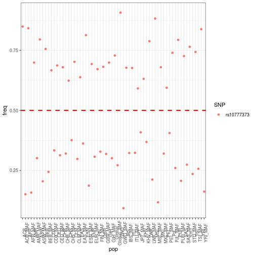

Actividades_clase4
========================================================
author: Erick Cuevas Fernandez
date: 20 septiembre 2019
autosize: true

Un poco de ggplot
========================================================
Cargamos datos de la clase pasada y cargamos archivos nuevos de la carpeta *clase4*


```r
library(ggplot2)
# ensanut <- read.csv("Seccion_Nutricion/Cuestionario_de_Problemas_de_Suenno/ensanut_suenno_16112016.csv")
# gwas_sleep <- read.csv("Clase_3/sleep_disorder.csv")
# paths <- read.csv("Clase_3/Paths_sleep.csv")
# freq <- seekerBio::seeker_snp_freq(gwas_sleep$SNPS)
# write.csv(freq, "Clase_4/Freq.csv")
# freqs_ordered <- seekerBio::seeker_snp_freq_format(freq)
# write.csv(freqs_ordered, "Clase_4/freq_format.csv")
freq_ordered <- read.csv("/home/erick/Curso-R-2019/Clase_4/freq_format.csv")
```


**RECUERDA QUE EL DATA SHEET DE GGPLO2 SE ENCUENTRA EN LA PAGINA DEL CURSO**

Tambien se encuentra en la carpeta de la clase 4. **Será tu guia para esta clase** 

RECUERDA
========================================================

- Checa la estructura de tus datos.  *str()*
- Observa de que variables se componen y de que tipo (numerico, factor, caracter).  *summary()*
- Si hay necesidad cambia el tipo de dato
- Limpia los datos antes de iniciar
- No es tan obvio el problema, habra ocasiones en las que deberan hacer mas con sus datos para poder lograr los graficos que se piden.


```r
freq_ordered$X <- NULL
one_snp <- freq_ordered[1,]
one_snp <- data.frame(t(one_snp))
SNP <- one_snp[1,]
one_snp_final <- data.frame(freq = one_snp[c(-1,-66,-67),], SNP = SNP)
one_snp_final$freq <- as.character(one_snp_final$freq)
one_snp_final$freq <- as.numeric(one_snp_final$freq)
one_snp_final$pop <- row.names(one_snp_final)

ggplot(one_snp_final, aes(x= pop, y= freq, color=SNP)) +
  geom_point() + theme_bw() + theme(axis.text.x = element_text(angle = 90)) +
  geom_hline(yintercept=0.5, linetype="dashed", 
             color = "red", size=1)
```




HOY VAMOS A TRABAJAR EN UN R Script
========================================================

**ACTIVIDAD 1, en grupos de 2 personas:**

- Realiza un grafico de puntos con el p-value de los SNPs del *gwas_sleep* y otro con el p-value de los pathways de *paths*
- Realiza un grafico de barras con alguna variable de archivo *ENSANUT*
- Realiza un grafico de distribucion de las frecuencias alelicas en poblacion EUROPEA y AMERICANA del archivo *freq_ordered*
- Realiza un grafico boxplot de alguna variable del archivo *ENSANUT*
- Realiza un grafico de puntos con las frecuencias alelicas de todo el mundo del archivo *freq_ordered* de un solo SNP


TUNEANDO LOS GRAFICOS
========================================================

- Intenta agregar un tema al graficos con *theme_bw()* por ejemplo.
- Agrega un titulo a cada grafico
- Agrega *theme(axis.text.x = element.text(angle = 90, size = 20))* y observa que sucede
- Representa en un grafico de puntos la frecuencia alelilica menor y ancestral de cada SNP de todas las poblaciones, y en el mismo grafico representa el alelo que cambia *Minor*, puedes hacerlo con *size* o *color* dentro del parametro *aes()*.
- Cambia de color todos los graficos que haz hecho
- Agrega *coord_flip()* a algun grafico y observa lo que sucede

**¿Dudas?**


